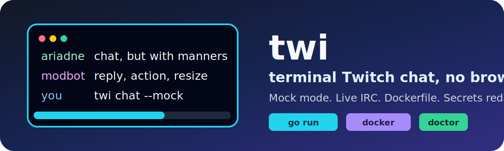

<p align="center">
  
</p>

<p align="center">
  <a href="https://go.dev/"></a>
  <a href="https://www.twitch.tv/"></a>
  <a href="Dockerfile"></a>
  <a href="docs/config.md"></a>
</p>

# twi

`twi` is a terminal Twitch chat client with taste. It is keyboard-first, fast to launch, friendly to low-drama terminals, and allergic to leaking your OAuth token.

The project is currently an MVP-shaped Go app: mock chat is ready without the network; live Twitch IRC read/send, diagnostics, redacted debug logging, multi-channel UX, inline image plumbing, OAuth login, setup, and Unix-only restrictive credential-file persistence are partially shipped; refresh-token persistence after IRC reconnect and manual Kitty/Ghostty image validation are still planned. Current manual terminal evidence is recorded in [docs/manual-validation.md](docs/manual-validation.md).

```text
        +---------------------------------------------+
        | twi chat --mock                             |
        |                                             |
        |  ariadne  chat in a terminal, but cute      |
        |  modbot   replies, /me, resize, scroll      |
        |  you      no browser tab circus required    |
        +---------------------------------------------+
```

## Start Here

Run the no-risk mock mode:

```sh
go run ./cmd/twi chat --mock --channel demo
```

Build and run the binary:

```sh
go build -o bin/twi ./cmd/twi
./bin/twi chat --mock --channel demo
```

Use Docker:

```sh
docker build -t twi:local .
docker run --rm -it twi:local chat --mock --channel demo
```

Check your setup:

```sh
go run ./cmd/twi doctor
docker run --rm twi:local doctor
```

Run the credential-free release packaging dry-run:

```sh
scripts/release-dry-run.sh --out /tmp/twi-release --image twi:local
```

The dry-run builds trimmed binaries for the supported target matrix, writes
SHA-256 checksums, builds the Docker image, and smokes help, doctor, and mock
chat with local config and Twitch credentials isolated. More detail:
[Release Packaging](docs/release.md).

## Live Twitch Chat

Live mode needs a Twitch login, an IRC OAuth token, and at least one channel. Repeat `--channel` to join multiple Twitch IRC channels. The token needs `chat:read`; sending from the composer also needs `chat:edit`. Username/token credentials can come from environment variables, the flat config file, or on Unix builds the private credential file created by `twi login`. Environment and flat config values take precedence over saved credentials. CLI flags currently override channels and config path, not username or token values.

The setup command writes non-secret config values and can hand off to login:

```sh
go run ./cmd/twi setup
go run ./cmd/twi setup --non-interactive --username your_twitch_login --channel somechannel
```

Setup updates username, Twitch app client ID, default channels, image modes,
emoji provider, mouse mode, and animation mode. It does not ask for or write
OAuth tokens, refresh tokens, callback codes, OAuth state, authorization URLs,
or client secrets.

```sh
export TWI_TWITCH_USERNAME="your_twitch_login"
export TWI_TWITCH_OAUTH_TOKEN="<your-twitch-oauth-token>"

go run ./cmd/twi chat --channel somechannel
go run ./cmd/twi chat --channel onechannel --channel anotherchannel
```

The shorter dotenv-style aliases also work:

```sh
export TWITCH_USERNAME="your_twitch_login"
export TWITCH_ACCESS_TOKEN="<your-twitch-access-token>"
export TWITCH_CLIENT_ID="your_client_id"
export TWITCH_CLIENT_SECRET="<your-twitch-client-secret>"
export TWITCH_REFRESH_TOKEN="<your-twitch-refresh-token>"
```

If Twitch IRC rejects the access token during login, `twi` will try one in-memory OAuth refresh and reconnect when `TWITCH_CLIENT_ID`, `TWITCH_CLIENT_SECRET`, and `TWITCH_REFRESH_TOKEN` are also configured. It does not write the refreshed token back to disk yet.

### OAuth Login Command

`twi login` starts a Twitch authorization-code login for the MVP IRC scopes:

- `chat:read`
- `chat:edit`

The command needs a Twitch app client ID and client secret from environment variables or the flat config file:

```sh
export TWI_TWITCH_CLIENT_ID="your_twitch_client_id"
export TWI_TWITCH_CLIENT_SECRET="<your-twitch-client-secret>"

go run ./cmd/twi login
```

By default it opens a browser and listens on `http://127.0.0.1:17643/oauth/twitch/callback`; register that redirect URI on the Twitch app or pass `--redirect-uri` for another localhost HTTP callback. On supported Unix builds, success validates the returned token, saves it through the private credential store, and prints only identity/scope/storage status. Non-Unix builds currently disable the credential-file store before opening the browser and direct users to environment variables or a private flat config file. The command does not print access tokens, refresh tokens, callback codes, OAuth state, authorization URLs, or client secrets.

Use the bounded noninteractive smoke path when you only want to check command wiring:

```sh
go run ./cmd/twi login --dry-run
```

The file fallback is Unix-only today. It stores a separate private `credentials.json` under a `0700` platform config directory, creates the file with `0600` permissions, rejects symlinked credential paths, and opens existing files with no-follow protection. Existing credential files or directories with different modes are rejected instead of reused. Windows and other non-Unix builds do not claim equivalent ACL or reparse-point guarantees, so the file fallback is disabled there. No OS keychain backend is implemented yet. If you keep duplicate credentials in environment variables or `config.toml`, those sources still win until you remove them.

Docker version:

```sh
docker run --rm -it \
  -e TWITCH_USERNAME \
  -e TWITCH_ACCESS_TOKEN \
  twi:local chat --channel somechannel
```

Do not paste real tokens into commits, screenshots, issue comments, terminal recordings, or public support threads. `twi config show`, `twi doctor`, and opt-in debug logs redact secrets by design, but review debug files before sharing because they can still include non-secret IDs, channel names, usernames, and hostnames.

## What Works Today

| Area | Status | Current behavior |
| --- | --- | --- |
| Mock chat | Ready | `twi chat --mock [--channel demo]` runs without Twitch credentials or network access. |
| Multi-channel live IRC read/send | Partial | `twi chat --channel <channel> [--channel other]` can read, send, reply, and send `/me` actions for configured channels when env/config credentials, or Unix saved credentials, are present; broader live manual evidence remains future work. |
| Config commands | Ready | `twi config show` prints effective flat config with secrets redacted; `twi config path` shows the default config path. |
| Diagnostics | Partial | `twi doctor` checks config path, credential presence, Twitch OAuth identity/expiry/scope validation, refresh availability, username mismatch, Twitch IRC reachability, terminal hints, Kitty/Ghostty signals, cache writability/pruning, image capability, live image-stack readiness, and feature modes. |
| Debug logging | Partial | Redacted JSON debug logs can be enabled with `debug_logging = true`, `TWI_DEBUG_LOG=true`, or `--debug-log` on chat, login, and doctor. Logs use curated fields for auth, transport, send, asset, and render diagnostics instead of raw struct or raw tag dumps. |
| Avatar metadata | Partial | When live chat runs with `avatar_mode = "image"` plus Twitch API credentials, a writable cache, and Kitty-compatible image capability, visible author avatar URLs are batched through Helix Get Users, downloaded, prepared, and rendered through async asset events while initials remain stable on every failure path. |
| Emote/badge metadata | Partial | Live startup can wire Helix-backed Twitch emote and badge metadata, the public downloader, disk cache, PNG preparer, and Kitty renderer behind config, credential, cache, and terminal gates while keeping compact badge labels and exact emote-token fallbacks stable. |
| Login/setup | Partial | `twi setup` creates or updates non-secret flat config values and can hand off to `twi login`; on supported Unix builds, `twi login` can run the browser/local-callback OAuth flow or `--dry-run` explanation, validate returned tokens, and save them through the restrictive credential-file fallback without printing them. Non-Unix builds keep env/config credentials as the supported path. |
| Multi-channel UX | Partial | Messages, unread counts, scroll, drafts, replies, sends, and local view filters are per-channel. Normal and wide terminals show a keyboard-first channel sidebar with connection indicators, unread counts, and filter markers; `ctrl+p` opens a keyboard command palette for common actions, panel toggles, channel switching, local filters, local clear, and live reconnect restart. Optional mouse support can scroll chat, click channels, focus the composer, and select messages. Selected messages can be inspected in a redacted diagnostics panel even when filters hide them from the chat view. Narrow terminals collapse channel state into the status line. Twitch IRC connect/reconnect/disconnect callbacks are connection-level and are shown on configured channel states rather than as independent per-channel transport events. Manual reconnect tears down the active live IRC transport before creating a fresh one while preserving per-channel UI state. |
| Inline terminal images | Partial | Live startup installs the concrete resolver/downloader/disk-cache/emoji-provider/Twitch-metadata/preparer/Kitty-renderer stack only when config, credentials for Twitch-backed assets, cache writability, and terminal capability allow it. Disabled, unsupported, missing-dependency, degraded, resolver failure, downloader failure, preparation failure, and render failure paths keep initials, badge labels, emote tokens, and Unicode emoji fallbacks. Manual Kitty/Ghostty validation remains pending. |

Manual validation evidence for the current environment is tracked in
[docs/manual-validation.md](docs/manual-validation.md). Credentialed Twitch chat
and real Kitty/Ghostty inline image drawing are only claimed when that document
records a complete credential set or a compatible graphics terminal session.

## Controls

| Key | Action |
| --- | --- |
| `ctrl+p` | Open or close the command palette. |
| `tab` | Switch focus between chat and composer. |
| `?` | Toggle expanded help. |
| `pgup` / `pgdown` | Scroll chat. |
| `up` / `down` | Select messages for reply or inspect mode. |
| `1` / `2` / `3` / `4` | Toggle local filters for mentions, broadcaster/mod/VIP messages, notices, and errors from chat focus. |
| `0` | Reset active-channel message filters. |
| `r` | Reply to the selected message. |
| `i` | Open or close the selected-message inspect panel. |
| `ctrl+l` | Clear the active channel's local chat history. |
| `ctrl+r` | Restart the active live chat source when supported, preserving channel history and drafts. |
| `esc` | Close inspect mode or cancel reply mode. |
| `enter` | Send from the composer in live mode. |
| `/me does a thing` | Send a Twitch action message. |

Mouse support is enabled by default. Set `enable_mouse = false` or `TWI_ENABLE_MOUSE=false` to keep terminal mouse reporting disabled; all workflows remain available from the keyboard.

## Configure It

Use environment variables for quick runs:

```sh
export TWI_DEFAULT_CHANNELS="somechannel"
export TWI_ANIMATION_MODE="fast"
export TWI_ENABLE_MOUSE="true"
export TWI_AVATAR_MODE="initials"
export TWI_EMOJI_PROVIDER="twemoji"
export TWI_EMOTE_MODE="text"
export TWI_DEBUG_LOG="false"
```

Or create the flat config file shown by:

```sh
twi config path
```

For a guided path, run `twi setup`. For automation or CI, use
`twi setup --non-interactive` with flags such as `--username`, `--channel`,
`--image-mode`, `--emoji-provider`, and `--animation-mode`.

Example:

```toml
twitch_username = "your_twitch_login"
twitch_oauth_token = "PLACEHOLDER_TWITCH_OAUTH_TOKEN"
twitch_refresh_token = "PLACEHOLDER_TWITCH_REFRESH_TOKEN"
twitch_client_id = ""
twitch_client_secret = ""
default_channels = "somechannel"
enable_kitty_images = true
enable_mouse = true
image_mode = "auto"
avatar_mode = "initials"
emoji_mode = "unicode"
emoji_provider = "twemoji"
emoji_url_template = ""
emote_mode = "text"
animation_mode = "fast"
debug_logging = false
debug_log_path = ""
```

For support diagnostics, enable redacted JSON logs explicitly:

```sh
twi chat --channel somechannel --debug-log
twi login --debug-log --debug-log-path /tmp/twi-debug.log
twi doctor --debug-log
```

When no path is provided, the log file is `debug.log` under the platform cache
directory. Existing debug-log files that are directories, symlinks, or allow
group/other access are rejected; Unix builds also open the final log path with
no-follow semantics before validating the opened file.

Nested TOML tables are not implemented yet. Keep the file flat.

Prefer `twi login` for saved tokens on supported Unix builds. If you also keep real tokens in the flat
config, keep that file private to your user account, for example with
`chmod 600`; flat config values still take precedence over saved credentials.

## Docker And Deploy

This is a terminal app, so "deploy" usually means "ship the binary or container to the machine where a human will run it in a real TTY."

```sh
docker build -t twi:local .
cp .env.example .env
docker compose run --rm mock
docker compose run --rm doctor
docker compose run --rm live
```

For live Docker runs, put real values only in your local ignored `.env`, pass credentials through environment variables, or use a private runtime secret mechanism. Do not bake tokens into the image.

More detail: [Docker Guide](docs/docker.md).

Release binary and container packaging is covered by
[Release Packaging](docs/release.md). The release dry-run is a separate
manual/tag workflow, not part of the default pull-request gate.

## Developer Commands

The default CI quality gate runs this same credential-free command set from a
clean checkout:

```sh
export GOTOOLCHAIN=auto TERM=xterm-256color
export XDG_CONFIG_HOME="$(mktemp -d)" XDG_CACHE_HOME="$(mktemp -d)"
export TWI_TWITCH_USERNAME= TWI_TWITCH_OAUTH_TOKEN= TWI_TWITCH_REFRESH_TOKEN=
export TWI_TWITCH_CLIENT_ID= TWI_TWITCH_CLIENT_SECRET=
export TWITCH_USERNAME= TWITCH_ACCESS_TOKEN= TWITCH_REFRESH_TOKEN=
export TWITCH_CLIENT_ID= TWITCH_CLIENT_SECRET=
go version
go mod tidy
go fmt ./...
git diff --exit-code
go vet ./...
go test ./...
go test -race ./...
go tool govulncheck ./...
go tool staticcheck ./...
go build -o /tmp/twi-validation ./cmd/twi
go run ./cmd/twi --help
go run ./cmd/twi chat --mock --channel example
go run ./cmd/twi chat --mock --channel one --channel two
go run ./cmd/twi doctor
go run ./cmd/twi config show
git diff --check origin/main...HEAD
```

Credentialed Twitch chat, Docker-only checks, and Kitty/Ghostty inline-image
validation are manual or release-specific checks, not part of the default pull
request gate.

If your PR targets a different base branch, replace `origin/main` with that
branch. Use plain `git diff --check` for uncommitted local changes.

Restricted environment cache-friendly form:

```sh
GOTOOLCHAIN=local GOCACHE=/tmp/twi-gocache GOMODCACHE=/tmp/twi-gomodcache go test ./...
```

## Docs For Humans

- [Quickstart](docs/quickstart.md)
- [Docker Guide](docs/docker.md)
- [Release Packaging](docs/release.md)
- [Authentication](docs/auth.md)
- [Configuration](docs/config.md)
- [Development](docs/development.md)
- [Terminal Images](docs/terminal-images.md)

## Project Direction

Near-term work is focused on keeping the MVP sharp: release packaging and manual terminal validation. The source of truth lives in the product docs under `docs/`.
