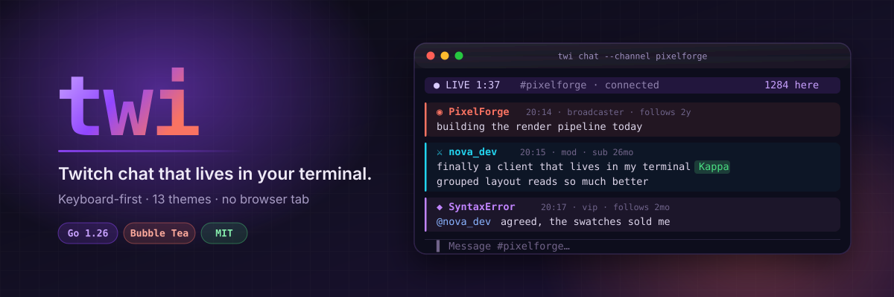
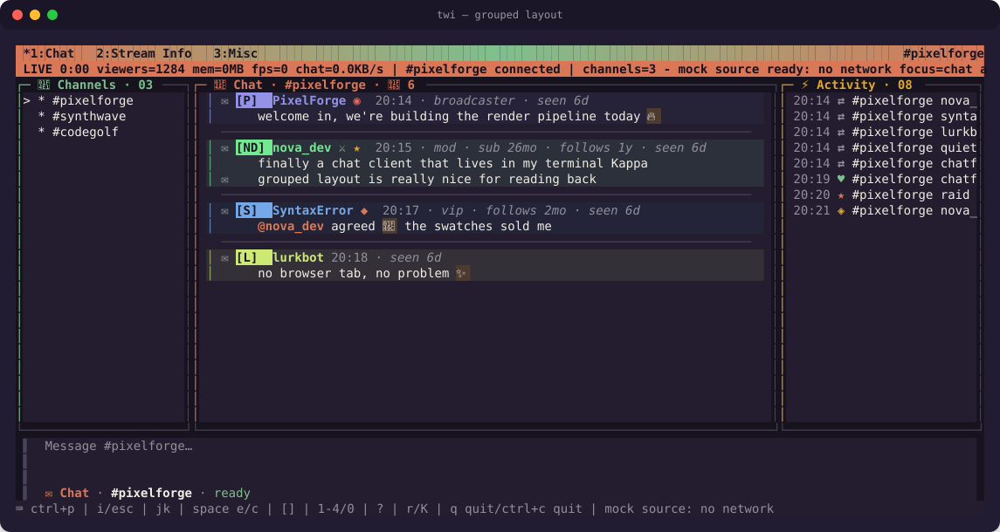
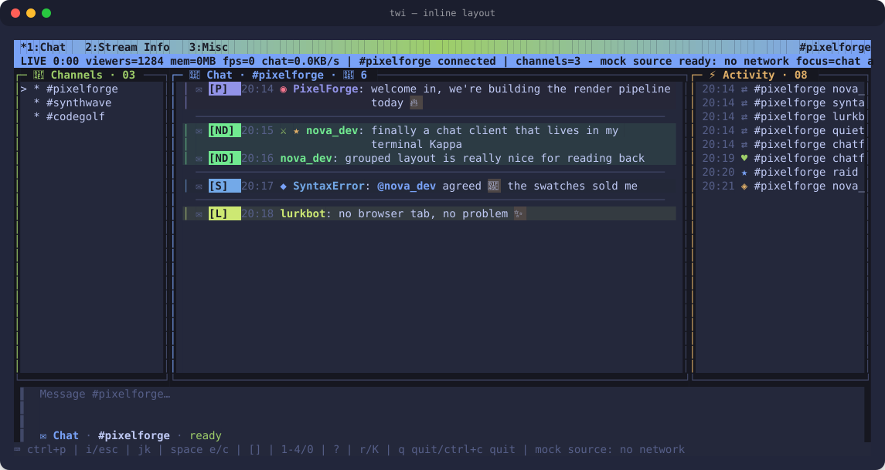
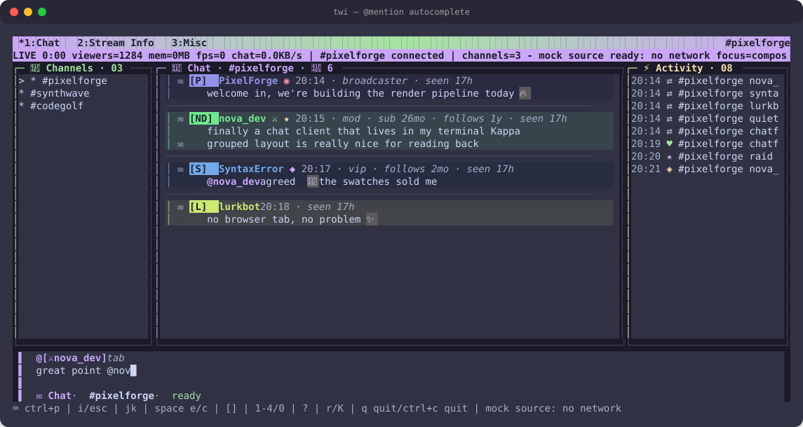
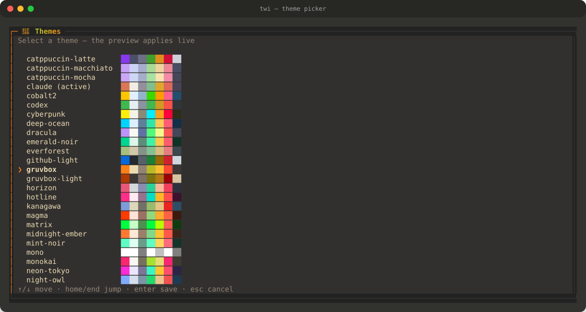

<p align="center">
  
</p>

<p align="center">
  <a href="https://worxbend.github.io/twi/"></a>
  <a href="https://obs.worxbend.com/"></a>
  <a href="https://go.dev/"></a>
  <a href="https://www.twitch.tv/"></a>
  <a href="Dockerfile"></a>
  <a href="docs/config.md"></a>
  <a href="LICENSE"></a>
</p>

<h1 align="center">twi</h1>

<p align="center">
  <b>Twitch chat that lives in your terminal.</b><br>
  Keyboard-first · 57 themes · no browser tab · allergic to leaking your OAuth token
</p>

<p align="center">
  <a href="#quickstart">🚀 Quickstart</a> ·
  <a href="#screenshots">📸 Screenshots</a> ·
  <a href="#controls">⌨️ Controls</a> ·
  <a href="#channels">📡 Channels</a> ·
  <a href="#configure-it">⚙️ Config</a> ·
  <a href="https://worxbend.github.io/twi/">🌐 Website</a> ·
  <a href="https://obs.worxbend.com/">🧰 More Tools</a> ·
  <a href="docs/index.md">📚 Docs</a>
</p>

---

```sh
go run ./cmd/twi chat --mock --channel demo   # 👈 no credentials, no network, full UI
```

## ✨ Highlights

| | |
| --- | --- |
| 🎨 **57 built-in themes** | 52 dark, including 24 vibrant near-black presets authored for twi (Neon Tokyo, Vaporwave, Hotline, Ultraviolet, Cyberpunk, Matrix, Toxic, Amber CRT, Midnight Ember, Blood Moon, Deep Ocean, Arctic Neon, Carbon, Plasma, Sapphire, Orchid, Ruby, Magma, Bullion, Emerald Noir, Mint Noir, Abyss, Spectre, Obsidian) alongside (Claude, Catppuccin ×3, Dracula, Gruvbox, Nord, Tokyo Night, Solarized Dark, Monokai, One Dark, Rose Pine ×2, Everforest, Kanagawa, Ayu ×2, Night Owl, Palenight, Synthwave '84, Oceanic Next, Nightfox, Zenburn, Cobalt2, Horizon, Codex, Btop, Mono) and 5 light (Catppuccin Latte, Rosé Pine Dawn, Gruvbox Light, Solarized Light, GitHub Light) — plus a custom hex palette. <kbd>ctrl+t</kbd> previews them live. |
| 🧩 **Three message layouts** | `grouped` (author header + collapsed run), `inline` (dense classic), `compact` (text only). Swap at runtime with <kbd>ctrl+g</kbd>. |
| 🌈 **Per-user color everywhere** | A stable hash-derived color per chatter, carried into their name, the message surface, and the gutter rail. |
| 💬 **@mention autocomplete** | Completes from people actually in chat, ranked by who spoke most recently. <kbd>tab</kbd> accepts. |
| 🏅 **Glyph badges + user context** | Broadcaster/mod/VIP/sub as compact icons, with sub tenure, follow age, and first-seen time. |
| ⚡ **Live activity column** | Raids, subs, cheers, follows, clips, and join/leave events with per-kind glyphs. |
| 🔐 **Secrets stay redacted** | Tokens, refresh tokens, client secrets, and callback values are kept out of output, logs, and diagnostics by design. |
| 🧪 **Mock mode** | The whole UI with zero credentials and zero network — ideal for trying it or filing bugs. |
| 🩺 **Honest diagnostics** | `twi doctor` reports what it verified *and* what it could not. |

<a id="screenshots"></a>

## 📸 Screenshots

> Every image is generated by rendering twi's real view and converting the terminal output to SVG,
> so it can't drift from what the app actually prints.
> Regenerate with `TWI_WRITE_SCREENSHOTS=1 go test ./internal/app -run TestWriteDocsScreenshots`.

<p align="center">
  
</p>

<details>
<summary>📜 <b>Inline layout</b> — the dense classic view (theme: <code>tokyo-night</code>)</summary>
<p align="center"></p>
</details>

<details>
<summary>💬 <b>@mention autocomplete</b> — completing from the live chatter roster (theme: <code>catppuccin-mocha</code>)</summary>
<p align="center"></p>
</details>

<details>
<summary>🎨 <b>Theme picker</b> — every preset with its own swatch strip, previewed live</summary>
<p align="center"></p>
</details>

## 🤔 Why It Exists

Most chat workflows force you back into a browser tab when the rest of your work is already in a terminal. `twi` keeps chat close to your shell, preserves keyboard-first workflows, and treats credentials like production secrets instead of casual config strings.

What makes this project different:

- 🖥️ A real TUI shell with mock mode, multi-channel state, command palette, selected-message inspect, reply context, local filters, and resize-aware layouts.
- 🔌 Live Twitch IRC read/send plumbing behind internal interfaces, with startup token validation and redacted auth-refresh behavior.
- 🔤 Text-first rendering for avatars, badges, emotes, emoji, replies, mentions, moderation notices, and system events — initials chips, stable per-username colors, glyph or text badges, matched emote tokens, and native Unicode emoji glyphs, with no inline-image rendering path.
- 🧱 Three switchable message layouts, per-user color carried into the message surface and gutter rail, `@name` autocomplete drawn from who is actually in chat, and always-visible author context plus a live chatter count.
- ⚙️ Async asset plumbing for Twitch avatar/emote/badge metadata without blocking the UI.
- 🛡️ A security posture that keeps OAuth tokens, refresh tokens, client secrets, callback values, and private config out of normal output and debug logs.

> [!NOTE]
> `twi` is MVP-shaped: mock chat and diagnostics are ready without credentials. Live Twitch IRC read/send,
> redacted debug logging, multi-channel UX, event notifications, text-based rendering, OAuth login, setup,
> and Unix credential-file persistence are shipped for their documented paths. Credentialed Twitch release
> validation remains environment-dependent — see [docs/manual-validation.md](docs/manual-validation.md).

## 📚 Documentation

The docs are split by audience:

| Need | Read |
| --- | --- |
| Run it quickly | [Quickstart](docs/quickstart.md) |
| Register your own Twitch app | [Twitch App Setup](docs/register-twitch-app.md) |
| Understand every doc | [Documentation Index](docs/index.md) |
| Configure auth and secrets | [Authentication](docs/auth.md) and [Configuration](docs/config.md) |
| Fix setup problems | [Troubleshooting](docs/troubleshooting.md) |
| Run with Docker | [Docker Guide](docs/docker.md) |
| Contribute safely | [Contributing](CONTRIBUTING.md), [Development](docs/development.md), and [Code Style](docs/code-style.md) |
| Report sensitive issues | [Security Policy](SECURITY.md) |
| Understand package boundaries | [Architecture](docs/architecture.md) |
| Cut release artifacts | [Release Packaging](docs/release.md) |
| See what changed | [Changelog](CHANGELOG.md) |
| See the wider toolkit | [worxbend streaming tools map](https://obs.worxbend.com/) — sibling OBS/Twitch utilities |

<a id="quickstart"></a>

## 🚀 Quickstart

Run the no-risk mock mode:

```sh
go run ./cmd/twi chat --mock --channel demo
```

Build and run the binary:

```sh
go build -o bin/twi ./cmd/twi
./bin/twi chat --mock --channel demo
```

Use Docker:

```sh
docker build -t twi:local .
docker run --rm -it twi:local chat --mock --channel demo
```

Check your setup:

```sh
go run ./cmd/twi doctor
docker run --rm twi:local doctor
```

Run the credential-free release packaging dry-run:

```sh
scripts/release-dry-run.sh --out /tmp/twi-release --image twi:local
```

The dry-run builds trimmed binaries for the supported target matrix, writes
SHA-256 checksums, builds the Docker image, and smokes help, doctor, and mock
chat with local config and Twitch credentials isolated. More detail:
[Release Packaging](docs/release.md).

Install a dry-run binary only after verifying its checksum:

```sh
cd /tmp/twi-release
sha256sum -c twi_linux_amd64.sha256
install -m 0755 twi_linux_amd64 "$HOME/.local/bin/twi"
twi --help
```

On Linux, published releases can also be installed with a curl-pipe script
that downloads the matching binary, verifies its checksum, and wires
`~/.local/bin` into `PATH`:

```sh
curl --proto '=https' --tlsv1.2 -sSf \
  https://github.com/worxbend/twi/releases/latest/download/install.sh | sh
```

More detail, including how to pin a version: [Release Packaging](docs/release.md).

Pick the artifact that matches your OS and CPU. There are no package-manager
manifests, signing, notarization, or registry publishing steps in this release
candidate path yet.

## 📺 Live Twitch Chat

> **Bring your own Twitch app.** `twi` has no built-in Twitch application. For
> `twi login` and every Twitch-API-backed feature you register a personal app
> in the [Twitch developer console](https://dev.twitch.tv/console/apps) and give
> `twi` its client ID and secret. See
> [docs/register-twitch-app.md](docs/register-twitch-app.md) for the full
> walkthrough and the minimal config to start.

Live mode needs an IRC OAuth token and at least one channel. You do **not** need to configure a username: twi authenticates as whichever account the token belongs to, because Twitch requires the IRC login to be the token's own account. The channels you join are independent of that account — you can sign in as one user and read or send in any channel you aren't banned from. A `twitch_username` naming a different account is reported as stale and ignored. Repeat `--channel`, or pass a comma-separated `--channels a,b`, to join multiple Twitch IRC channels; the two accumulate, so they can be mixed. Starting with no channel at all is supported and lands on an empty state that `/channels` fills. The token needs `chat:read`; sending from the composer also needs `chat:edit`. Before starting live IRC, `twi chat` validates token identity, expiry, and required scopes when Twitch OAuth validation is reachable. Definitive invalid-token states stop startup with redacted guidance; transient validation failures warn and continue to IRC authentication. Username/token credentials can come from environment variables, the flat config file, or the private credential store created by `twi login` on supported Unix platforms. Unix builds use a restrictive credential file. Non-Unix builds keep saved credentials disabled; use environment variables or a private flat config file there. Environment and flat config values take precedence over saved credentials. CLI flags currently override channels and config path, not username or token values.

The setup command writes non-secret config values and can hand off to login:

```sh
go run ./cmd/twi setup
go run ./cmd/twi setup --non-interactive --username your_twitch_login --channel somechannel
```

Setup updates username, Twitch app client ID, default channels, avatar mode,
mouse mode, and animation mode. It does not ask for or write OAuth tokens,
refresh tokens, callback codes, OAuth state, authorization URLs, or client
secrets.

```sh
export TWI_TWITCH_USERNAME="your_twitch_login"
export TWI_TWITCH_OAUTH_TOKEN="<oauth token from Twitch>"

go run ./cmd/twi chat --channel somechannel
go run ./cmd/twi chat --channel onechannel --channel anotherchannel
go run ./cmd/twi chat --channels onechannel,anotherchannel
go run ./cmd/twi chat   # no channel: opens the empty state, then /channels
```

The shorter dotenv-style aliases also work:

```sh
export TWITCH_USERNAME="your_twitch_login"
export TWITCH_ACCESS_TOKEN="<oauth token from Twitch>"
export TWITCH_CLIENT_ID="your_client_id"
export TWITCH_CLIENT_SECRET="<client secret from Twitch>"
export TWITCH_REFRESH_TOKEN="<refresh token from Twitch>"
```

If Twitch IRC rejects the access token during login, `twi` will try one OAuth refresh and reconnect when `TWITCH_CLIENT_ID`, `TWITCH_CLIENT_SECRET`, and `TWITCH_REFRESH_TOKEN` are also configured. On supported Unix platforms, refreshed access and refresh tokens are saved through the private credential store. If saving is unsupported or fails, `twi` keeps the refreshed tokens in memory for the current chat session and reports a redacted warning.

### 🔑 OAuth Login Command

`twi login` starts a Twitch authorization-code login for:

- `chat:read`
- `chat:edit`
- `channel:manage:broadcast` (view/edit title, category, language, and tags on the Stream Info tab; create/list stream markers on the Misc tab)
- `moderator:read:followers` (follower count in the status line)
- `channel:read:subscriptions` (subscriber count in the status line)
- `user:read:follows` (autocomplete the `/channels` picker from the channels you follow)
- `clips:edit` (create clips of your active stream with the `/clip` chat command)

The command needs a Twitch app client ID and client secret from environment variables or the flat config file:

```sh
export TWI_TWITCH_CLIENT_ID="your_twitch_client_id"
export TWI_TWITCH_CLIENT_SECRET="<client secret from Twitch>"

go run ./cmd/twi login
```

By default it opens a browser and listens on `http://localhost:1337/api/connect/twitch/callback`; register that redirect URI on the Twitch app or pass `--redirect-uri` for another localhost HTTP callback. For example, if the Twitch app is registered with `http://127.0.0.1:17643/oauth/twitch/callback`, run:

```sh
go run ./cmd/twi login --redirect-uri http://127.0.0.1:17643/oauth/twitch/callback
```

To avoid passing `--redirect-uri` every time, set `twitch_redirect_url` in
`config.toml` or `TWI_TWITCH_REDIRECT_URL`/`TWITCH_REDIRECT_URL` instead — an
explicit `--redirect-uri` flag still takes precedence over all of them.

On supported Unix platforms, success validates the returned token, saves it through the private credential store, and prints only identity/scope/storage status. Non-Unix builds stop before opening the browser and direct users to environment variables or a private flat config file. The command does not print access tokens, refresh tokens, callback codes, OAuth state, authorization URLs, or client secrets.

Use the bounded noninteractive smoke path when you only want to check command wiring:

```sh
go run ./cmd/twi login --dry-run
```

First time here? `go run ./cmd/twi login --write-default-config` writes a
starter `config.toml` (non-secret keys only, current defaults plus anything
already in your environment) at the effective config path before continuing —
but only if that file doesn't already exist yet, so it never clobbers one you
already have.

The file fallback is Unix-only. It stores a separate private `credentials.json` under a `0700` platform config directory, creates the file with `0600` permissions, rejects symlinked credential paths, and opens existing files with no-follow protection. Existing credential files or directories with different modes are rejected instead of reused. Non-Unix builds keep saved credentials disabled. If you keep duplicate credentials in environment variables or `config.toml`, those sources still win until you remove them.

Docker version:

```sh
docker run --rm -it \
  -e TWITCH_USERNAME \
  -e TWITCH_ACCESS_TOKEN \
  twi:local chat --channel somechannel
```

Do not paste real tokens into commits, screenshots, issue comments, terminal recordings, or public support threads. `twi config show`, `twi doctor`, and opt-in debug logs redact secrets by design, but review debug files before sharing because they can still include non-secret IDs, channel names, usernames, and hostnames.

## ✅ What Works Today

| Area | Status | Current behavior |
| --- | --- | --- |
| Mock chat | Ready | `twi chat --mock [--channel demo]` runs without Twitch credentials or network access. |
| Multi-channel live IRC read/send | Partial | `twi chat --channel <channel> [--channel other]` or `--channels a,b` (and `twi chat` with no channel at all, which starts empty and waits for `/channels`) validates startup credentials when Twitch OAuth validation is reachable, then can read, send, reply, and send `/me` actions for configured channels when env/config credentials or saved credentials on supported Unix platforms are present; broader live manual evidence remains future work. |
| Config commands | Ready | `twi config show` prints effective flat config with secrets redacted; `twi config path` shows the default config path. |
| Diagnostics | Ready | `twi doctor` checks config path, credential presence, Twitch OAuth identity/expiry/scope validation, refresh availability, username mismatch, Twitch IRC reachability, terminal hints, cache writability/pruning, and feature modes. Live chat also preflights token validation before IRC startup when validation is reachable. |
| Debug logging | Ready | Redacted JSON debug logs can be enabled with `debug_logging = true`, `TWI_DEBUG_LOG=true`, or `--debug-log` on chat, login, and doctor. Logs use curated fields for auth, transport, send, asset, and render diagnostics instead of raw struct or raw tag dumps. |
| Avatar metadata | Partial | When live chat runs with `avatar_mode = "initials"` (the default) plus Twitch API credentials and a writable cache, visible author display names are batched through Helix Get Users to render a per-author `[XY]` initials chip; `avatar_mode = "off"` hides the chip. There is no image rendering path. |
| Emote/badge metadata | Partial | Live startup can wire Twitch IRC fragment data for emotes and Helix-backed fallback emote/badge metadata behind config, cache, credential, and terminal gates, always rendering compact badge labels (for example `[mod]`, `[sub]`, `[vip]`) and matched emote text tokens (for example `Kappa`). |
| Login/setup | Partial | `twi setup` creates or updates non-secret flat config values and can hand off to `twi login`; on supported Unix builds, `twi login` saves through the restrictive credential-file fallback. Non-Unix builds keep env/config credentials as the supported path. |
| Multi-channel UX | Partial | Channels open and close at runtime through the `/channels` picker (`space` `c`), which autocompletes from your Twitch follow list when `user:read:follows` is granted and accepts any typed name otherwise; opening joins on the live IRC connection without a reconnect. Messages, unread counts, scroll, drafts, replies, sends, and local view filters are per-channel. Normal and wide terminals show a keyboard-first channel sidebar with connection indicators, unread counts, and filter markers; `ctrl+p` opens a keyboard command palette for common actions, panel toggles, channel switching, local filters, local clear, and live reconnect restart. Optional mouse support can scroll chat, click channels, focus the composer, and select messages. Twitch `USERNOTICE` events such as raids carry normalized event IDs; when the relevant chat is not active, the terminal is blurred, or another panel has focus, `twi` attempts a desktop system notification, falls back to a terminal bell, and shows a status-line notification summary. Selected messages can be inspected in a redacted diagnostics panel even when filters hide them from the chat view. Narrow terminals collapse channel state into the status line. Twitch IRC connect/reconnect/disconnect callbacks are connection-level and are shown on configured channel states rather than as independent per-channel transport events. Manual reconnect tears down the active live IRC transport before creating a fresh one while preserving per-channel UI state. |
| Text-only asset rendering | Ready | Avatars, badges, emotes, and emoji always render as text: `[XY]` initials chips (or nothing when `avatar_mode = "off"`), compact badge labels, matched emote text tokens, and native Unicode emoji glyphs. There is no image decode, cache, or terminal-graphics rendering path; missing metadata, missing credentials, or lookup failures simply keep the text fallback. |
| Theming | Ready | 57 built-in presets — 52 dark, including 24 vibrant near-black presets authored for twi (Neon Tokyo, Vaporwave, Hotline, Ultraviolet, Cyberpunk, Matrix, Toxic, Amber CRT, Midnight Ember, Blood Moon, Deep Ocean, Arctic Neon, Carbon, Plasma, Sapphire, Orchid, Ruby, Magma, Bullion, Emerald Noir, Mint Noir, Abyss, Spectre, Obsidian) alongside (Claude, Codex, Btop, Nord, Dracula, Gruvbox, Solarized Dark, Monokai, One Dark, Tokyo Night, Catppuccin Mocha/Macchiato/Frappé, Rosé Pine, Rosé Pine Moon, Everforest, Kanagawa, Ayu Dark, Ayu Mirage, Night Owl, Palenight, Synthwave '84, Oceanic Next, Nightfox, Zenburn, Cobalt2, Horizon, Mono) and 5 light (Catppuccin Latte, Rosé Pine Dawn, Gruvbox Light, Solarized Light, GitHub Light) — plus a custom hex palette apply across every widget. The application canvas is derived slightly darker than the selected background, while icon-titled panes use the raised surface color, quiet frames, independently colored left rails, and shared-clock focus gradients on auxiliary panes. The Chat pane frame and title remain static. Consecutive messages from the same author share one surface/rail group; a subtle horizontal rule and alternating group surface appear only when the visible author changes. Each username also keeps a stable hash-derived readable color. The borderless composer uses a raised surface, focus rail, block cursor, and `Chat · #channel · state` footer inspired by modern coding TUIs. `ctrl+t` opens a btop-style full-screen theme page that lists every preset with a swatch strip of its own colors, live-previews the highlighted theme as you move the selection, and persists it with `enter` (`esc` reverts); `twi profile list\|show\|set` manages the same setting from the CLI. |
| Animation | Ready | A shared ~10fps clock (disabled when `animation_mode = "off"`) drives seamless mirrored gradients, pulsing LIVE/REC and incoming-message rails, typewriter chat and command-palette reveals, and a staged ~2s block-logo startup sequence (skippable by any keypress). Chrome labels share a text-effect engine with four treatments — typewriter (caret reveal), gradient wave, shimmer sweep, and bouncing marker with a fading trail — used for the splash tagline and strapline and the no-channels-open empty state; every effect keeps its label's display width on every frame, so nothing reflows, and `animation_mode = "off"` renders the same words statically. Moving gradients travel through a `start → end → start` palette so either side wraps without a visible color seam. The Chat pane border/title are deliberately excluded. Reduced mode slows decorative gradient motion. |
| Live status telemetry | Partial | The status bar shows real Twitch broadcast status via Helix "Get Streams" polling (LIVE + elapsed on-air time + viewer count) when `stream_status_mode` and Twitch API credentials allow it, otherwise OFFLINE; follower and subscriber counts poll Helix "Get Channel Followers"/"Get Broadcaster Subscriptions" every 2 minutes when credentials and the `moderator:read:followers`/`channel:read:subscriptions` scopes allow it; REC reflects `debug_logging`; CPU%/memory/FPS are twi's own process stats; "chat" bitrate is derived chat-message throughput, not stream encode bitrate. `--mock` simulates a fixed demo LIVE state. |
| Emote autocomplete | Partial | `ctrl+e` opens a searchable emote/emoji picker. A built-in emoji set is always available; real Twitch global/channel emotes merge into it when `emote_autocomplete_mode` and credentials allow. Mock mode demonstrates the combined workflow and emoji-rich messages without network access. |
| Activity log column | Partial | On wide terminals (140+ columns), the Chat tab shows a right-hand Activity column alongside chat (and the optional channel sidebar) covering every alert twi can currently detect over IRC and Helix polling: raids, subs/resubs/gift subs/gift upgrades, announcements, charity donations, and moderation actions from Twitch IRC events; cheers (detected from a chat message's "bits" tag, since Twitch sends cheers as ordinary PRIVMSGs, not a USERNOTICE); new followers (detected by polling Get Channel Followers and diffing against previously seen followers, since Twitch only pushes follow events through EventSub, not IRC or any webhook twi can receive); stream went-live/went-offline transitions (detected by polling Get Streams, the same status the LIVE/OFFLINE badge uses); and clips created with `/clip`. Alerts that only exist through EventSub (hype train, polls/predictions, channel-point redemption details) aren't available since twi has no EventSub/WebSocket connection. Hidden below 100 columns and on the Stream Info/Misc tabs, and `space` `a` shows or hides it explicitly at any width the terminal can afford. `<` and `>` resize it (the sidebar instead while that pane has focus), `=` returns both to automatic sizing, and `sidebar_width`/`activity_width` set a starting width in config. |
| `/clip` command | Partial | Typing `/clip`, `/clip T-5m`, or `/clip T-4m T-2m` in the composer creates a clip of the current stream through Helix "Create Clip" when credentials, the `clips:edit` scope, and being live all allow it; the API has no start/end/duration parameter, so the `T-` offsets are only echoed back next to the clip's edit URL as a trim reminder, never sent to Twitch. |

Manual validation evidence for the current environment is tracked in
[docs/manual-validation.md](docs/manual-validation.md). Credentialed Twitch chat
is only claimed when that document records a complete credential set.

<a id="controls"></a>

## ⌨️ Controls

| Key | Action |
| --- | --- |
| `alt+1` / `alt+2` / `alt+3` | Switch the top tab bar between Chat, Stream Info, and Misc. |
| `ctrl+p` | Open or close the command palette. |
| `ctrl+t` | Open or close the full-screen theme page; live-preview a theme with `up`/`down`, jump with `home`/`end`, `enter` to save, `esc` to revert. |
| `ctrl+e` | Open or close the searchable emote picker; filter by typing, `up`/`down` to select, `enter` to insert. |
| `ctrl+g` | Cycle the chat message layout: `inline` → `grouped` → `compact`. Saved to the config file. |
| `ctrl+b` | Cycle badge rendering beside usernames: `glyph` → `text` → `off`. Saved to the config file. |
| `ctrl+y` | Toggle the tinted background chip behind emotes and emoji. Saved to the config file. |
| `ctrl+n` | Toggle full usernames (`DisplayName (login)`). Saved to the config file. |
| `@` + `tab` | Complete a chat username. Type `@` and a prefix, `up`/`down` to pick, `tab` to insert, `esc` to dismiss. |
| `i` / `o` / `a` | Focus the composer and start typing (vim insert keys). |
| `esc` | Leave the composer for the chat view, keeping the draft; from chat, close inspect mode, cancel reply mode, or close an open overlay. |
| `j` / `k` | Select the next/previous message (chat focus) or move the sidebar highlight. |
| any key during the splash | Skip the startup animation. |
| `space` `e` | Show or hide the channel sidebar. |
| `space` `a` | Show or hide the Activity column. |
| `<` / `>` | Resize the pane you are in: the Activity column normally, or the channel sidebar while it has focus. Chat absorbs the difference. |
| `=` | Reset both side panes to sizing themselves from the terminal width. |
| `space` `c` | Open the `/channels` picker. |
| `space` `x` | Close the active channel. |
| `space` `i` | Open or close the selected-message inspect panel (same as `K`). |
| `tab` | Cycle focus between chat, the composer, and the channel sidebar when it is visible. |
| `?` | Toggle expanded help. |
| `pgup` / `pgdown` | Scroll chat. |
| `up` / `down` | Select messages for reply or inspect mode (chat focus), or navigate an open overlay. |
| `1` / `2` / `3` / `4` | Toggle local filters for mentions, broadcaster/mod/VIP messages, notices, and errors from chat focus. |
| `0` | Reset active-channel message filters. |
| `r` | Reply to the selected message. |
| `K` | Open or close the selected-message inspect panel. |
| `ctrl+l` | Clear the active channel's local chat history. Press twice — the first press asks, any other key cancels. |
| `ctrl+r` | Restart the active live chat source when supported, preserving channel history and drafts. |
| `enter` | Send from the composer in live mode, or run the highlighted entry in an open picker. |
| `/me does a thing` | Send a Twitch action message. |
| `/channels`, `/channels somechannel` | Open the channel picker, or open a named channel directly (see [Channels](#channels)). |
| `/clip`, `/clip T-5m`, `/clip T-4m T-2m` | Create a clip of the current stream (see [Clip Command](#clip-command)). |

With the channel sidebar focused, `j`/`k` move the highlight, `enter` or `l`
switches to the highlighted channel, `x` closes it, and `h` or `esc` returns to
chat.

Mouse support is enabled by default: click a tab to switch screens, click a
channel in the sidebar to switch to it (or its `✕` to close it), click a row in
the command palette or a picker to run it, click the composer or a message to
focus and reply, and scroll chat with the wheel. Set `enable_mouse = false` or
`TWI_ENABLE_MOUSE=false` to keep terminal mouse reporting disabled; all
workflows remain available from the keyboard.

Terminal focus reporting is enabled for interactive chat sessions. Terminals that
do not report focus still behave as focused, so system-event notifications avoid
extra alerts unless another in-app panel or channel has the user's attention.
Desktop notifications are best effort and dependency-free: Linux uses
`notify-send`, macOS uses `osascript`, Windows uses PowerShell toast APIs, and
unsupported or unavailable notification commands fall back to a terminal bell.

<a id="channels"></a>

## 📡 Channels

Channels can be opened and closed while `twi` is running; the set you start
with (`--channel`, `--channels`, or `default_channels`) is only a starting
point, and starting with none is fine.

- **Open one**: type `/channels` in the composer, or press `space` `c`. The
  picker lists the channels already open, then the channels you follow, and
  finally the name you typed verbatim — so an unfollowed channel is still one
  `enter` away. `/channels somechannel` skips the picker entirely.
- **Autocomplete**: the follow list comes from Twitch Helix "Get Followed
  Channels" and needs the `user:read:follows` scope. Tokens issued before that
  scope was requested keep working — the picker says so inline and falls back
  to open and configured channels. Run `twi login` again to grant it. The list
  is fetched once per session.
- **Close one**: press `space` `x` for the active channel, or focus the
  sidebar (`tab`, or `space` `e` then `tab`) and press `x` on the highlighted
  row. With a mouse, click the `✕` on the highlighted sidebar row. Closing the
  last channel returns to the empty state rather than exiting.
- **Sidebar**: `space` `e` shows or hides the channel list. It appears
  automatically once a second channel is open and the terminal is wide enough;
  the toggle overrides that for the session.

Opening a channel joins it on the existing IRC connection, so no reconnect is
needed; closing one parts it. Both are also reflected in the reconnect list, so
a manual `ctrl+r` rejoins exactly what is open.

## 📊 Stream Info Tab

`twi` opens with a top tab bar that shows the configured Twitch username and
active chat name; `alt+1` selects Chat (the default), `alt+2` selects Stream
Info, and `alt+3` selects Misc. Stream Info is a dedicated screen for viewing
and editing your own channel's title, category, language, and tags without
leaving the terminal. On that tab, `up`/`down` selects a
field and `ctrl+s` saves every changed field to Twitch. `enter` on
Title/Language/Tags edits free text (`enter` again commits, `esc` cancels).
`enter` on Category instead opens a live search against Twitch's category
list (Helix Search Categories): type to filter, `up`/`down` to pick a
result, `enter` to select it, or `esc` to cancel - category is always a
real Twitch category chosen from the API, never free-typed text.

The Stream Info tab needs a Twitch app client ID and OAuth token (the same
credentials live chat uses) and the `channel:manage:broadcast` scope, which
`twi login` requests automatically alongside `chat:read`/`chat:edit`. Without
those credentials the tab explains what is missing instead of failing
silently.

## ⏺️ Misc Tab

`alt+3` opens Misc, which lists your own stream's markers (Twitch Helix
Stream Markers) and lets you add new ones. `up`/`down` selects a marker,
`enter` opens a free-text description prompt (`enter` again saves the
marker at the current live position, `esc` cancels the prompt without
creating one). Creating a marker only succeeds while you're live - Twitch
rejects it otherwise, and that error shows in the tab. Misc uses the same
`channel:manage:broadcast` scope and credentials as Stream Info, so no
separate login step is needed.

## ✂️ Clip Command

Typing `/clip` in the composer and pressing `enter` creates a Twitch clip of
your current stream (Twitch Helix "Create Clip"), needing the `clips:edit`
scope that `twi login` requests automatically. `/clip` only succeeds while
you're live; that error, and a missing-scope error, both show as
human-readable status-line text instead of raw JSON.

Twitch's Create Clip API has no parameter for a start time, end time, or
duration - it always captures approximately the last 30-60 seconds at the
moment of the call, with no way to reach further back. `/clip T-5m` and
`/clip T-4m T-2m` accept those offsets anyway, but only to echo the range
you asked for back to you alongside the clip's edit URL, as a reminder of
what to trim to in Twitch's own clip editor - the offsets are never sent to
Twitch, since the API can't act on them. A successful clip also appears in
the Activity log column with its edit URL.

<a id="configure-it"></a>

## ⚙️ Configure It

Use environment variables for quick runs:

```sh
export TWI_DEFAULT_CHANNELS="somechannel"
export TWI_ANIMATION_MODE="fast"
export TWI_ENABLE_MOUSE="true"
export TWI_AVATAR_MODE="initials"
export TWI_THEME_NAME="claude"
export TWI_STREAM_STATUS_MODE="auto"
export TWI_EMOTE_AUTOCOMPLETE_MODE="auto"
export TWI_DEBUG_LOG="false"
```

Or create the flat config file shown by:

```sh
twi config path
```

For a guided path, run `twi setup`. For automation or CI, use
`twi setup --non-interactive` with flags such as `--username`, `--channel`,
`--avatar-mode`, and `--animation-mode`.

Example:

```toml
twitch_username = "your_twitch_login"
twitch_oauth_token = ""
twitch_refresh_token = ""
twitch_client_id = ""
twitch_client_secret = ""
twitch_redirect_url = ""
default_channels = "somechannel"
enable_mouse = true
avatar_mode = "initials"
animation_mode = "fast"
theme_name = "claude"
theme_background = ""
theme_foreground = ""
theme_accent = ""
theme_muted = ""
theme_border = ""
theme_surface = ""
theme_warning = ""
theme_error = ""
theme_success = ""
stream_status_mode = "auto"
emote_autocomplete_mode = "auto"
debug_logging = false
debug_log_path = ""
```

### 🎨 Themes

`theme_name` selects one of 57 built-in presets — 52 dark (`claude` (default),
`codex`, `btop`, `nord`, `dracula`, `gruvbox`, `solarized-dark`, `monokai`,
`one-dark`, `tokyo-night`, `catppuccin-mocha`, `catppuccin-macchiato`,
`catppuccin-frappe`, `rose-pine`, `rose-pine-moon`, `everforest`, `kanagawa`,
`ayu-dark`, `ayu-mirage`, `night-owl`, `palenight`, `synthwave-84`,
`oceanic-next`, `nightfox`, `zenburn`, `cobalt2`, `horizon`, `mono`, plus 13
vibrant near-black presets authored for twi: `neon-tokyo`, `vaporwave`, `hotline`, `ultraviolet`, `cyberpunk`, `matrix`, `toxic`, `amber-crt`, `midnight-ember`, `blood-moon`, `deep-ocean`, `arctic-neon`, `carbon`, `plasma`, `sapphire`, `orchid`, `ruby`, `magma`, `bullion`, `emerald-noir`, `mint-noir`, `abyss`, `spectre`, `obsidian`) and 5
light (`catppuccin-latte`, `rose-pine-dawn`, `gruvbox-light`,
`solarized-light`, `github-light`) — applied across every
widget, including a slightly darker derived application canvas behind raised
pane surfaces. Light presets map the scheme's lightest base to the background
and the next tone up the ramp to pane surfaces, so panes still read as raised
above that derived canvas. Set `theme_name = "custom"`
and fill in the `theme_*` hex fields above for your own palette; unset custom
fields fall back to no styling for that role.

The background isn't just painted within the rendered viewport: interactive
sessions send an OSC 11 escape sequence that overrides the terminal
emulator's own default background color to match that derived canvas, and restore the
terminal's original background (OSC 111) when `twi` exits. This is supported
by xterm, iTerm2, kitty, Alacritty, WezTerm, and VTE-based terminals;
unsupported terminals simply ignore the sequence.

Manage themes from the CLI:

```sh
twi profile list                 # preset names, with the active one marked
twi profile show                 # active theme name + resolved hex values
twi profile set nord             # persist a built-in preset
twi profile set custom --background '#000000' --foreground '#ffffff' --accent '#ff00ff'
```

Or interactively: press `ctrl+t` in the chat shell for a btop-style theme page.
It takes over the whole terminal rather than docking under the chat, lists every
preset with a swatch strip of its own colors, and live-previews the highlighted
one as you move the selection. `up`/`down` and `home`/`end` move, `enter` saves,
`esc` reverts.

The status bar's LIVE indicator reflects the channel's real Twitch broadcast
status (polled via Helix "Get Streams" every 60s when `stream_status_mode`
and Twitch API credentials allow it) — not just the local IRC connection.
REC reflects `debug_logging` (twi's own debug-log recording), since twi has
no other "recording" concept. The "chat" throughput figure is derived from
actual incoming chat-message bytes, not stream encode bitrate, which Twitch
does not expose through any public API.

For support diagnostics, enable redacted JSON logs explicitly:

```sh
twi chat --channel somechannel --debug-log
twi login --debug-log --debug-log-path /tmp/twi-debug.log
twi doctor --debug-log
```

When no path is provided, the log file is `debug.log` under the platform cache
directory. Existing debug-log files that are directories, symlinks, or allow
group/other access are rejected; Unix builds also open the final log path with
no-follow semantics before validating the opened file.

Nested TOML tables are not implemented yet. Keep the file flat.

Prefer `twi login` for saved tokens on supported Unix platforms. Leave secret
values empty in shared examples and docs. If you also keep real tokens in the
flat config, keep that file private to your user account, for example with
`chmod 600`; flat config values still take precedence over saved credentials.

## 🚧 Known Release Gaps

The release candidate path is intentionally explicit about what is not yet
claimed:

- Credentialed Twitch read/send/reconnect and browser login still require a
  real Twitch app, username, token set, and manual validation evidence.
- Exact Docker CLI smokes need a Docker-enabled host; Podman-equivalent smokes
  do not replace the final Docker check.
- Refreshed IRC tokens are persisted only when the supported credential store
  is available; otherwise they remain in memory for the current process with a
  redacted warning.
- Non-Unix saved credentials are out of scope; use environment variables or a
  private flat config file if you build for an unsupported platform.
- Package-manager manifests, signing, notarization, registry publishing, and
  SBOM/provenance are post-release work.

## 🐳 Docker And Deploy

This is a terminal app, so "deploy" usually means "ship the binary or container to the machine where a human will run it in a real TTY."

```sh
docker build -t twi:local .
cp .env.example .env
docker compose run --rm mock
docker compose run --rm doctor
docker compose run --rm live
```

For live Docker runs, put real values only in your local ignored `.env`, pass credentials through environment variables, or use a private runtime secret mechanism. Do not bake tokens into the image.

More detail: [Docker Guide](docs/docker.md).

`twi` is also packaged as a snap (`snap/snapcraft.yaml`, classic confinement,
`amd64`/`arm64`). Once published:

```sh
sudo snap install twi --classic
```

Release binary, container, and snap packaging are covered by
[Release Packaging](docs/release.md). The release dry-run and snap build are
separate manual/tag workflows, not part of the default pull-request gate.

## 🛠️ Developer Commands

The default CI quality gate runs this same credential-free command set from a
clean checkout:

```sh
export GOTOOLCHAIN=auto TERM=xterm-256color
export XDG_CONFIG_HOME="$(mktemp -d)" XDG_CACHE_HOME="$(mktemp -d)"
export TWI_TWITCH_USERNAME= TWI_TWITCH_OAUTH_TOKEN= TWI_TWITCH_REFRESH_TOKEN=
export TWI_TWITCH_CLIENT_ID= TWI_TWITCH_CLIENT_SECRET=
export TWITCH_USERNAME= TWITCH_ACCESS_TOKEN= TWITCH_REFRESH_TOKEN=
export TWITCH_CLIENT_ID= TWITCH_CLIENT_SECRET=
go version
go mod tidy
go fmt ./...
git diff --exit-code
go vet ./...
go test ./...
go test -race ./...
go tool govulncheck ./...
go tool staticcheck ./...
go build -o /tmp/twi-validation ./cmd/twi
go run ./cmd/twi --help
go run ./cmd/twi chat --mock --channel example
go run ./cmd/twi chat --mock --channel one --channel two
go run ./cmd/twi chat --mock --channels one,two
go run ./cmd/twi doctor
go run ./cmd/twi config show
git diff --check origin/main...HEAD
```

Credentialed Twitch chat and Docker-only checks are manual or release-specific
checks, not part of the default pull request gate.

If your PR targets a different base branch, replace `origin/main` with that
branch. Use plain `git diff --check` for uncommitted local changes.

Restricted environment cache-friendly form:

```sh
GOTOOLCHAIN=local GOCACHE=/tmp/twi-gocache GOMODCACHE=/tmp/twi-gomodcache go test ./...
```

## 🗺️ Contributor Map

- [Contributing](CONTRIBUTING.md) explains the support boundary, safe workflow, verification commands, PR checklist, and secret-handling rules.
- [Code Style](docs/code-style.md) defines package ownership, rendering rules, debug logging rules, comments, tests, and documentation style.
- [Architecture](docs/architecture.md) shows how config, Twitch transport, Bubble Tea state, rendering, assets, storage, and debug logging fit together.
- [Development](docs/development.md) records the deeper implementation state, toolchain, quality gates, and testing strategy.

## 🧭 Project Direction

Near-term work is focused on release evidence and credentialed Twitch validation when credentials are available. The product source of truth lives in [docs/index.md](docs/index.md) and the product docs under `docs/product/`.

## 📄 License

`twi` is released under the [MIT License](LICENSE).
